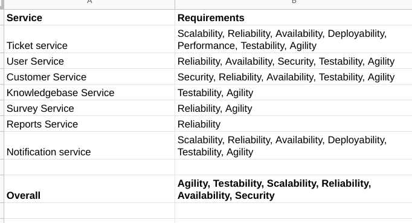
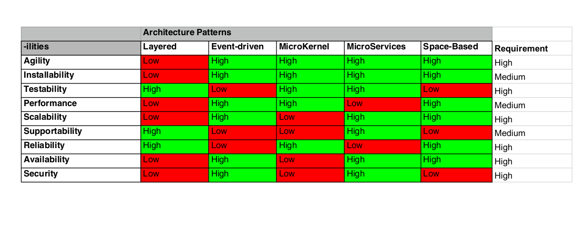

## ADR - Final Architectural pattern for the system.

### Status
Proposed

### Context
In order to build the components identified from event storming, an architectural style should be chosen.
- Identify non-functional requirements (-ilities) for each component.
- Identify those -ilities which make sense for the system as a whole from the above.
- Identify the architectural pattern using a matrix of patterns vs -ilities and overlapping it with the system requirements. See diagram below.

### Decision
From the above matrix, Microservices have the least no. of reds. Hence, it is decided that we can use Microservices pattern for the system. 

### Consequences
As you can see from the matrix, performance (due to network delay) and reliability are low for microservices. 

Since there are only 100s or 1000s of users using the system in a day, performance should not be a cause for concern. Reliability can be improved by using a reliable messaging queue in the system to trigger those processes which may take time.
