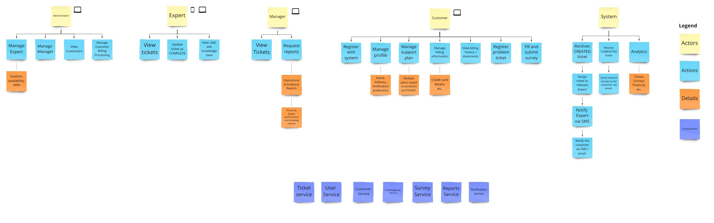
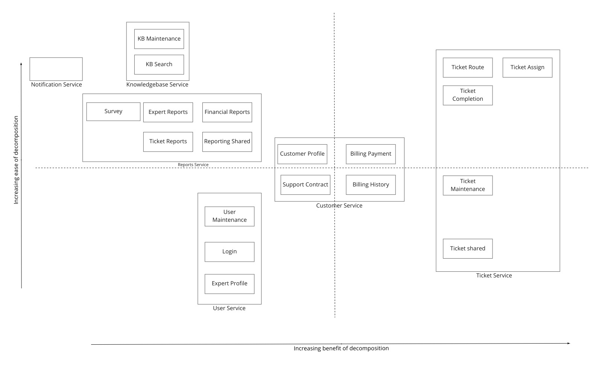

# Sysops Squad Migration

## Table of Contents
- [Introduction](#introduction)
- [Assumptions](#assumptions)
- [Migration Plan](#migration-Plan)
- [Further Improvements](#further-Improvements)
- [Note](#note)
- [References](#references)

## Introduction
Since tickets form the crux of the Sysops Squad business, ticket related problems in the current system should be prioritised in order to continue business. Those problems are:

- Customers are complaining that consultants are never showing up due to lost tickets.
- Oftentimes the wrong consultant shows up to fix something they know nothing about.
- Customers and call-center staff have been complaining that the system is not always available for web-based or call-based problem ticket entry.

Also, the following need to be addressed as part of or soon after solving the above problems:

- Change is difficult and risky in this large monolith. Whenever a change is made, it takes too long and something else usually breaks.
- Due to reliability issues, the monolithic system frequently “freezes up” or crashes.

## Assumptions
- The existing application is a single process monolithic system.
- In the architecture components diagram given in the presentation, the bold bordered components exist as modules in a repository (say github).
- It is a Java based spring application.
- The monolith exposes REST API endpoints to the outside world.
- There are materialised views in the database for the various reports.
- The current monolithic system has the following asynchronous operations:
  - Assigning an Expert to a ticket, post its creation.
  - Notifying an Expert when a ticket is assigned.
  - Notifying a Customer after an Expert is assigned.
  - Sending a survey to a Customer, post ticket completion.
  - Sending billing or offers related notifications to Customers.
- Ticket Shared component has business logic to create,update (change state) and fetch tickets in the system.
- Ticket Maintenance component has simple APIs to fetch, create and update tickets from the database. Only Ticket Shared component accesses Ticket Maintenance component.
- There are interfaces for all the behaviours exposed by the components. This would enable swapping implementations in case of roll backs during migration.
- The static files of the user interface are in a different location than the backend code. 

## Migration Plan
### Step 1
Investigate the current system to find the root cause of the problems.

- Check the logs for errors or stack traces. See what is causing the tickets to go missing. Some of the speculations that can be made are:
  - A ticket may be in limbo due to a faulty state machine when the system is unable to find an Expert for the job at the time of processing (first run).
    - Implement a simple state machine, if not already present. It may look like this 
    - Also, the code to handle the state machine and the actions emanating from it should be in one place. See [State Machine in one place](ADRs/adr_state_machine_in_one_place.md)
  - There might not be a reliable queue due to which the async events may be getting lost when the system freezes.
    - Check Step 2 below for this.
  - Memory overflow issues, especially during peak loads.
    - For checking this, try to increase the RAM and/or the no. of processors for the machine on which this monolith is deployed. (In case of a dockerised environment, increase the RAM the application can actually consume)
- Check if the logic for assigning an expert is correct. From the first look at the database given in the slides, there is no products table. Also, there may not be a relationship between product and expertise, and between product and ticket. 
  - Introduce a products table in the database. 
  - Add an expertise column in the product table. 
  - A ticket should also contain the product details. This would help while assigning an expert (with a particular expertise) to the ticket.

- Once the above checks are done, proceed forward.

### Step 2
Swap the implementation of the current asynchronous blackbox delivery system from Ticket Shared to Ticket Assigned, Ticket Route and Ticket Completion with a reliable messaging service implementation, like RabbitMQ, if not already present. Check [ADR - RabbitMQ for handling events.](ADRs/adr_rabbitmq.md)

- Introduce a publisher class to publish ticket events to RabbitMQ.
- Use the Actor pattern to listen to ticket events and pass it on to the corresponding implementations.
  - Limit the no. of threads the actor can spawn and use in the RabbitMQ consumer configuration.
- Use feature flags or environmental variables to conditionally switch between old and new implementations in case of rollback.
- Deploy and test the change in dev environment.
- Once the changes are stable, deploy the change to production.

### Step 3
Identify the services in the final refactored architecture.

- After an event storming exercise using the Actor-Action approach, the following services are identified in the first run - Ticket, User, Customer, Notification, Reports, Knowledgebase and Survey
- Since scalability, availability and performance requirements for the survey and report services are not that high, they could be clubbed under one service, say Reports Service.
- So finally, we have Ticket, User, Customer, Notification, Reports and Knowledgebase services.

### Step 4
Identify the architecture pattern.
See [ADR - Architectural Pattern](ADRs/adr_arch_pattern.md) 

### Step 5
Prioritise the components that need to be migrated from the existing system.

- Components in the current system and their dependencies were drawn out.
- Components with the least no. of incoming arrows were identified and put in a quadrant of increasing ease of decomposition vs increasing benefit of decomposition.
- Components in the top right quadrant should be considered for migration first.
- So, consider Tickets -> Reports -> Customer -> Knowledge Base -> Notification -> User

### Step 6
Migrate Ticket related components from monolith to Ticket Service. Use *Strangler Fig* pattern with shallow extractions to extract out Ticket Assign, Ticket Route and Ticket Completion components to Ticket Service. Here’s how to extract Ticket Assign

- Create an empty Ticket Service microservice.
  - The ticket related tables would continue to live in the monolith for sometime.
- Copy over the code from **ss.ticket.assign** namespace to the new microservice.
  - Check [ADR - Extract code first for asynchronous ticket processes.](ADRs/adr_extract_code_first.md)
- In the new microservice, modify the implementation of **TicketAssignImpl** class to call corresponding REST controllers in the monolith to fetch expert data and update ticket status.
- Have a feature flag to not initialise TickerAssignActor in the monolith. Leave the rest of the **ss.ticket.assign** namespace in the monolith as is, in case of a roll back.
- Deploy and test the change in dev environment.
- Once the changes are stable, deploy the change to production.
- If the migration goes as expected, remove the code from **ss.ticket.assign** namespace  in the monolith.

Use the same technique to extract out Ticket Route and Ticket Completion components.

### Step 7
Move the foreign key relationships on the ticket tables from database layer to code layer. Currently,

- Ticket table depends on the product and customer tables (Move)
- Article table depends on Ticket\_History and Sysops\_User tables (Move)
- Ticket\_History table depends on Ticket table (Keep)

Process:
- Mark (rename) current ticket and knowledgebase service implementation classes to old. **TicketServiceImplOld** and **KBServiceImplOld**
- Write new implementation classes which validate the foreign key relationships in code.
- Have a feature flag to quickly switch between old and new implementations.
- Write versioned db migration scripts (preferably flyway) to remove the above mentioned foreign key relationships.
- Deploy and test the change in dev environment.
- Once the changes are stable, deploy the change to production.

### Step 8
Move the ticket related tables to the ticket database.

- Write scripts to copy over Ticket\_Type, Ticket\_History and Ticket tables to ticket database.
- Make the monolith talk to the ticket database for ticket related information and the monolith database for the rest of the information.
- Deploy and test the change in dev environment.
- Once the changes are stable, deploy the change to production.

### Step 9
Use *Branch by Abstraction* pattern to extract out Ticket Shared and Ticket Maintenance components into Ticket Service.

- At this point, many services in the monolith depend on the Ticket Shared component. So, it is better to go for *Branch by Abstraction* pattern.
  - Step A
    - Introduce a dormant client (**TicketServiceClient**) which implements TicketService interface and has code to forward requests to Ticket Service Microservice.
    - Have a feature flag to quickly switch between the current **TicketServiceImpl** and new **TicketServiceClient**. For now, point the switch to use **TicketServiceImpl.**
    - Copy over the code from **ss.ticket** namespace to Ticket service microservice.
    - Deploy and test the change in dev environment.
      - Note that, right now, the **ss.ticket** component would not be active and does not store state (not pointing to a database). However, the change can be tested out partially (for connectivity and workflows) by writing tests on **TicketServiceClient** class**.** These tests would normally return an error at the time of storing or retrieving the state.
    - Once the changes are stable, deploy the change to production.
  - Step B
    - Make the switch in the monolith to use the **TicketServiceClient** instead of **TicketServiceImpl**.
    - Point Ticket Service microservice to ticket database.
    - Deploy and test the change in dev environment.
    - Once the changes are stable, deploy the change to production.
- If the migration goes as expected, remove the code, except TicketServiceClient, from **ss.ticket** namespace in the monolith.

### Step 10
Migrate **Reporting Shared**, **Expert Reports**, **Ticket Reports** and **Financial Reports** components from monolith to Reports Service.

- Since no other components in the system depend on the above components, they can be extracted out of the monolith using the *Strangler Fig Pattern.* Refer to Step 6 on how this can be done.
- Report service need not have a database of its own yet. All the information needed for this service to function exists in the monolith. 
- Deploy and test the change in dev environment.
- Once the changes are stable, deploy the change to production.
- If the migration goes as expected, remove the code from **ss.report** namespace in the monolith.

### Step 11
Move the foreign key relationships on the customer tables from database layer to code layer. Currently,

- Customer table depends on the Contract, Customer_Survey, Billing and Ticket tables (Move)
- Customer_Notification table depends on the Customer table. (Keep)

Process:
- Refer to Step 7 above for example.

### Step 12
Move the customer and billing related tables to the customer database. They are Customer, Customer_Notification, Contract, Billing, Product, Payment and Payment_Method.

Process:
- Refer to Step 8 above for example.

### Step 13
Migrate **Support Contract**, **Billing Payment** and **Billing History** components from monolith to Customer Service.

- Since no other components in the system depend on the above components, they can be extracted out of the monolith using the *Strangler Fig Pattern.* Refer to Step 6 on how this can be done.
- Deploy and test the change in dev environment.
- Once the changes are stable, deploy the change to production.
- If the migration goes as expected, remove the code from **ss.billing.payment** and **ss.billing.history** namespaces in the monolith.

### Step 14
Migrate **Customer Profile** component from monolith to Customer Service.

- Use *Branch by Abstraction pattern* to achieve this. Refer to Step 9 above for an example on how to go about doing this.
- Deploy and test the change in dev environment.
- Once the changes are stable, deploy the change to production.

### Step 15
Move the foreign key relationships on the knowledgebase tables from database layer to code layer.

- Article table depends on the Sysops_User table (Move)
- Rest of the foreign keys among Tag, Article_Tag, Article, Keyword and Article_Keyword can be kept intact.

Process:
- Refer to Step 7 above for example.

### Step 16
Migrate Knowledgebase related components from monolith to Knowledgebase Service. They are KB Maintenance and KB Search.

- Since no other components in the system depend on the Knowledge base component, it can be extracted out of the monolith using the *Strangler Fig Pattern.* Refer to Step 6 on how this can be done.
- Deploy and test the change in dev environment.
- Once the changes are stable, deploy the change to production.
- If the migration goes as expected, remove the code from **ss.kb.maintenance** and **ss.kb.search** namespaces in the monolith.

### Step 17
Migrate Survey related components from monolith to Reports Service.

- The only components depending on Survey component are Ticket Completion and Expert Reports. These are already moved out to their respective services above. So Survey may be extracted out using *Strangler Fig Pattern*
- Deploy and test the change in dev environment.
- Once the changes are stable, deploy the change to production.
- If the migration goes as expected, remove the code from **ss.survey** namespace in the monolith.

### Step 18
Migrate User Service
- This service may continue to exist in the monolith because most of the code in the monolith has been moved / removed. However, it would be best to have login handled by an external IDP (like okta or auth0) for better security (in terms of multi-factor authentication) since the system is handling credit card information. 

### Final Architecture

## Further Improvements
- [ADR - Products table in Customer Service](ADRs/adr_products_in_customer_service.md)
- Notification component currently co-exists with Login Component. Ideally notification service may exist independently, catering to billing notifications for customers and general info (for now and internal users later on). Also, its scale and purpose are different from the rest of the system. Notification service may also maintain customer’s/expert’s ticket related notifications, which are currently sent via email/SMS, for tracking (to avoid repudiation).
- Currently, there seems to be no relation between survey and ticket. Add a ticket_id to the survey table.

## Note
- Repository layer in the service has been omitted in many diagrams for brevity.
- Once the production deployment is complete in any step mentioned above
  - sanity test the environment.
  - Monitor the system.
  - Roll back if there are any failures or performance issues.
    - Since we are using a reliable queue, any failures in message delivery can be handled independently after the rollback.
  

## References
https://betterprogramming.pub/rabbitmq-vs-kafka-1779b5b70c41

https://learning.oreilly.com/library/view/monolith-to-microservices/9781492047834/

https://microservices.io/refactoring/
